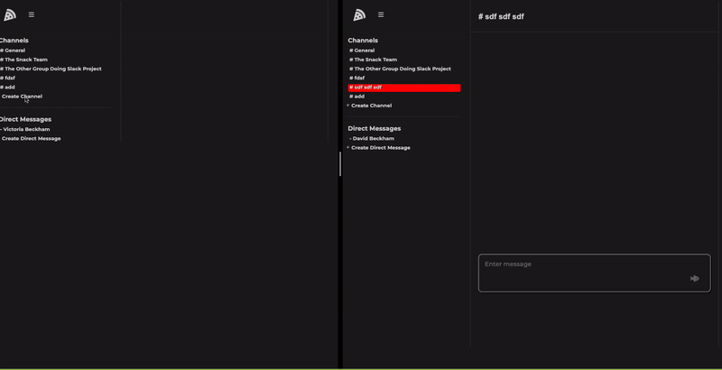
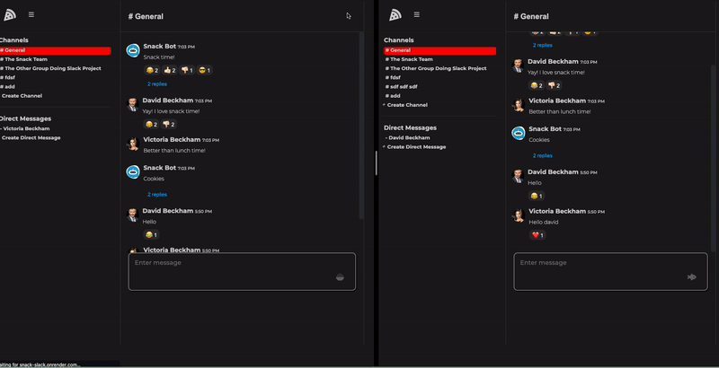

# Snack

Snack is a snack themed live chat web application inspired by Slack. We welcome you to live chat with other users and share your favorite snacks!

Check out [Snack](https://snack-slack.onrender.com/) here.

## Technologies Used

<div align='center'>
  
  
  
  
  
  
  
  
  
  
  
</div>


## Live Chat and Reactions with WebSockets


## Create and Edit Channels


## Reply to Messages


## Features

### Channels
Logged-in users can: 
* Create a new channel with any number of users
* Read/View all channels you are a member of
* Update channels they have created
* Delete channels they have created

### Messages
Logged-in users can: 
* Create a message in any channel or direct message they are a member of
* Read/View all messages of any channel or direct message they are a member of
* Update messages they have posted
* Delete/Remove messages they have posted

### Threads/Replies
Logged-in users can: 
* Create a reply to a message
* Read/View all replies of a message
* Delete/Remove replies they have posted

### Reactions
Logged-in users can: 
* Add a reaction to any message
* Read/View all reactions on messages
* Delete/Remove reactions they have added


## API Routes

### Authentication

### -------------
* URL: `/api/auth/`

* METHOD: `GET`

```
    Authenticates a user.

```

### -------------
* URL: `/api/auth/login`

* METHOD: `POST`

```
    Logs a user in

```

### -------------
* URL: `/api/auth/logout`

* METHOD: `GET`

```
    Logs a user out

```

### -------------
* URL: `/api/auth/signup`

* METHOD: `POST`

```
    Creates a new user and logs them in

```

### -------------
* URL: `/api/auth/unauthorized`

* METHOD: `GET`

```
    Returns unauthorized JSON when flask-login authentication fails

```

### Users

### -------------
* URL: `/api/users/`

* METHOD: `GET`

```
    Query for all users and returns them in a list of user dictionaries

```

### -------------
* URL: `/api/users/<int:id>`

* METHOD: `GET`

```
    Query for a user by id and returns that user in a dictionary

```

### Channels

### -------------
* URL: `/api/channels`

* METHOD: `GET`

```
    This route gets all channels that are in the db

```

### -------------
* URL: `/api/channels/<int:id>`

* METHOD: `GET`

```
    This route get one channel by channel_id

```

### -------------
* URL: `/api/channels`

* METHOD: `POST`

```
    This route creates a channel for the logged-in user

```

### -------------
* URL: `/api/channels/<int:id>`

* METHOD: `PUT`

```
    This route updates the name and description of the channel specified by id
    for the logged-in user if that user is the owner

```

### -------------
* URL: `/api/channels/<int:channelId>/add-members`

* METHOD: `PUT`

```
    This route adds members to the channel specified by id
    for the logged-in user if that user is the owner

```

### -------------
* URL: `/api/channels/<int:channelId>/delete-members`

* METHOD: `PUT`

```
    This route deletes members of the channel specified by id
    for the logged-in user if that user is the owner

```

### -------------
* URL: `/api/channels/<int:id>`

* METHOD: `DELETE`

```
    This route deletes the channel specified by id
    if the logged-in user is the owner

```

### Messages

### -------------
* URL: `/api/messages/channels/<int:channelId>`

* METHOD: `GET`

```
    This route gets all messages in the specified channel
    
```

### -------------
* URL: `/api/messages/<int:messageId>`

* METHOD: `GET`

```
    This route grabs all threads from a message Id

```

### -------------
* URL: `/api/messages/channels/<int:channelId>`

* METHOD: `POST`

```
    This route creates messages in the specified channel

```

### -------------
* URL: `/api/messages/<int:messageId>`

* METHOD: `PUT`

```
    This route updates the specified message

```

### -------------
* URL: `/api/messages/<int:messageId>`

* METHOD: `DELETE`

```
    This route deletes the message specified by id if the logged-in user is the message creator.

```

### Reactions

### -------------
* URL: `/api/reactions/<int:messageId>`

* METHOD: `POST`

```
    This route create reaction for message by messageId

```

### -------------
* URL: `/api/reactions/<int:reactionId>`

* METHOD: `DELETE`

```
    This route deletes the reaction specified by id if the logged-in user is the reaction creator.

```

### Threads

### -------------
* URL: `/api/messages/<int:messageId>/threads`

* METHOD: `POST`

```
    This route creates threads for the specified message

```

### -------------
* URL: `/api/threads/<int:threadId>`

* METHOD: `DELETE`

```
    This route deletes a thread given the thread Id

```
